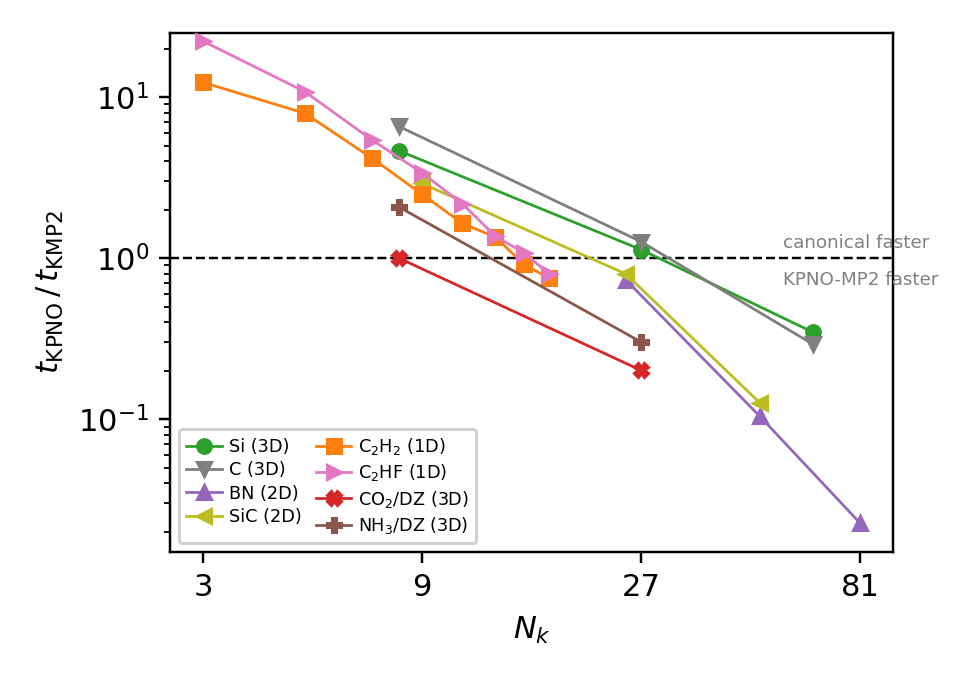
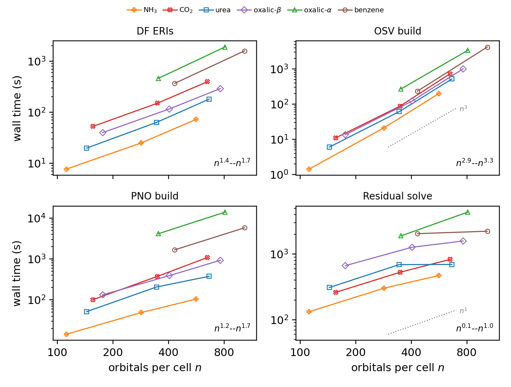

# lpno

local MP2 in pyscf with pbc support

## install

```bash
git clone https://github.com/welltemperedpaprika/lpno.git
cd lpno
pip install -e .
```

## usage

```python
from pyscf.pbc import gto, scf
from pyscf.pbc.lpno import KPNOMP2   # or kdOSVMP2

cell = gto.Cell()
cell.atom = 'He 0 0 0'
cell.a = '3.0 0 0; 0 3.0 0; 0 0 3.0'
cell.basis = 'gth-dzvp'
cell.pseudo = 'gth-pade'
cell.build()

kmesh = [2, 2, 2]
kpts = cell.make_kpts(kmesh)
kmf = scf.KRHF(cell, kpts).density_fit().run()

lo_coeff = ...   # localized occupied orbitals; see examples/pbc/lpno/00-kpnomp2.py

mp = KPNOMP2(kmf, lo_coeff, kmesh=kmesh)
mp.thresh_pno = 1e-8
mp.kernel()
print(mp.e_corr)
```

the methods take localized occupied orbitals as input. the scripts in
`examples/pbc/lpno/` show two ways to get them: one using only stock pyscf
(`00-kpnomp2.py`), and one using periodic Pipek-Mezey (`01-kdosvmp2_kpipek.py`;
needs `pyscf.pbc.lo.kpipek`, a periodic localization code developed by
Hong-Zhou Ye and Gengzhi Yang).

`00-kpnomp2.py` is complete and runs in about a second on a laptop:

```
$ python examples/pbc/lpno/00-kpnomp2.py
...
KPNOMP2 E_corr = -0.0205653437
```

tested with pyscf 2.13.1.

## accuracy

KPNO-MP2 converges to canonical periodic MP2 as the PNO threshold is tightened,
and the correlation part of the cohesive energy extrapolates to the TDL along
with canonical k-point MP2.


the scripts and data for these are in `figures/`.

## performance

KPNO-MP2 crosses over canonical k-point DF-MP2 in wall time as the k-mesh
grows, and is more than an order of magnitude faster at the largest meshes
tested (both methods timed in the same job on the same node):



measured per-stage scaling with orbital count at a fixed 2x2x2 k-mesh: the
OSV build is the basis-cubic step, and the PNO-space steps scale well below
that:



as above, the scripts and data are in `figures/`.

## tests

```bash
pytest pyscf/pbc/lpno/test
```

the suite runs in a few seconds (15 tests, pyscf 2.13.1).

## citation

if you use this, please cite the accompanying paper (Liang, Yang, Ye, and
Berkelbach; in preparation).

## license

Apache 2.0, see LICENSE.
